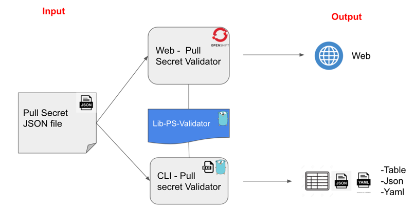

# lib-ps-validator

<a href='https://github.com/jpoles1/gopherbadger' target='_blank'></a>

# Disclaimer

This repository and its contents are completely **UNSUPPORTED** in any way and are not part of official documentation.

# Description
This is a go library created to validate a pull secret keeping in mind the next concepts:

+ Inputs: [] byte (with the pull secret in json format)
+ Output: Struct of interfaces with the information structured in 3 parts:
    + Valid Entries
    + Expired Entries
    + Connection Issues (Sometimes could be an internal registry with some problems to be connected)
  


# How to use it
There are two repo to consume the library. One of them is for the WebUI deployed just for internal staff engineering:

+ pullsecret-validator repo [https://github.com/RHsyseng/pullsecret-validator](https://github.com/RHsyseng/pullsecret-validator)
+ WebUI is deployed here (just for internall staff): [http://pullsecret-validator-pullsecret-validator.apps.shift.cloud.lab.eng.bos.redhat.com/](http://pullsecret-validator-pullsecret-validator.apps.shift.cloud.lab.eng.bos.redhat.com/)

And the second one is a CLI to use in your vm,host, instance, even inside your CI/CD pipeline:

+ pullsecret-validator-cli repo [https://github.com/RHsyseng/pullsecret-validator-cli](https://github.com/RHsyseng/pullsecret-validator-cli)
+ The binaries for most platform: [https://github.com/RHsyseng/pullsecret-validator-cli/releases/latest](https://github.com/RHsyseng/pullsecret-validator-cli/releases/latest)


# How to use it (as a developer)
Just import or get the package using this command:

```golang
go get github.com/RHsyseng/lib-ps-validator
import github.com/RHsyseng/lib-ps-validator
```
Main function is:
```golang
func Validate(input []byte) WebData 
```

Where the WebData is the model:
```golang
type WebData struct {
	Input     interface{}
	ResultOK  interface{}
	ResultKO  interface{}
	ResultCon interface{}
}
```


